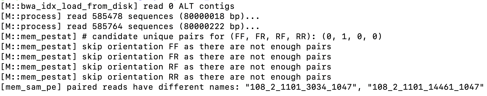

# TAREA OPCIONAL F

### BIOINFORMATIC QUESTION

*Martínez Andrade Elsa Gabriela. Junio, 2020*

My bioinformatic question is at the time of making the BWA script, to align with a reference genome.

The error is the one seen in image 1. I divided the bioinformatic problem into two parts. The first as we can see *[M::mem_pestat]  skip orientation FF as there are not enough pairs*, this also happens for *FR, RF, RR*.

Looking for the possible cause of this error in biostars. At firts this can indicate that the orientation and distance between the paired end reads is not what the tool expects. Also algorithm selection should not affect the read pairing that the tool reports.

A possible explanation for this error is that read pairs are listed in the wrong order. Another common mistake is that the input contains the files Forward (R1 and R1) instead of Forward and Reverse (R1 and R2). This last error is ruled out since I made sure that the inputs were F1 and F2. 
<https://www.biostars.org/p/158395/>

This answer is the one that best fits my script error. Unless I have mate pairs, they shouldn't face away from each other (have an RF orientation). **This is expected with illumina sequencing.**

Therefore, in Illumina sequencing, he obtained the majority of FR, for which the other three options were discarded.
<https://www.biostars.org/p/175748/>

Second part *[mem__sam_ _pe] paired reads have different names*.  
This can happen, because the fastq files are not correct, that is, they are not properly paired R1 with R2, or there may be empty readings on the fastqc.

Also BWA requires that paired reads have completely identical read names.

In addition to checking, I can also add the -p flag to my script (-p flag, assume the first input query file is interleaved paired-end FASTA/Q).  <https://www.biostars.org/p/300262/>, <https://www.biostars.org/p/254155/>.

Therefore, thanks to the biostars forum you can understand the errors broken down into two parts. This is important because we must take into account the types of data we are working on and the importance of the names of each reading.

1. Image showing the bioinformatic error

    

